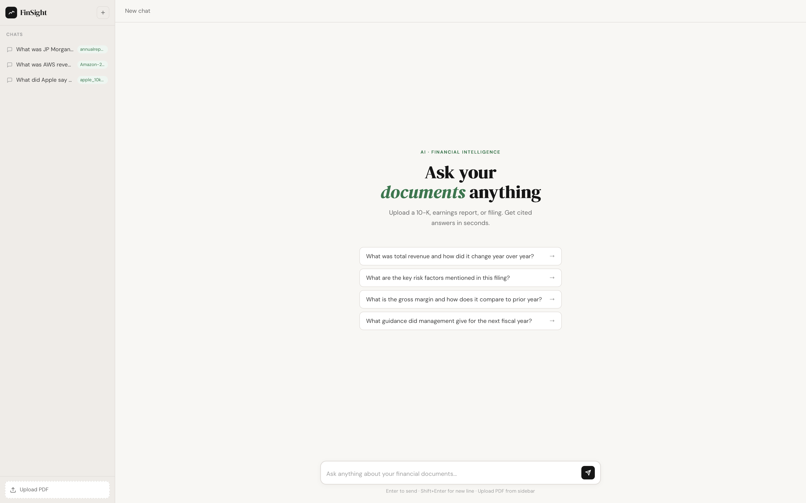
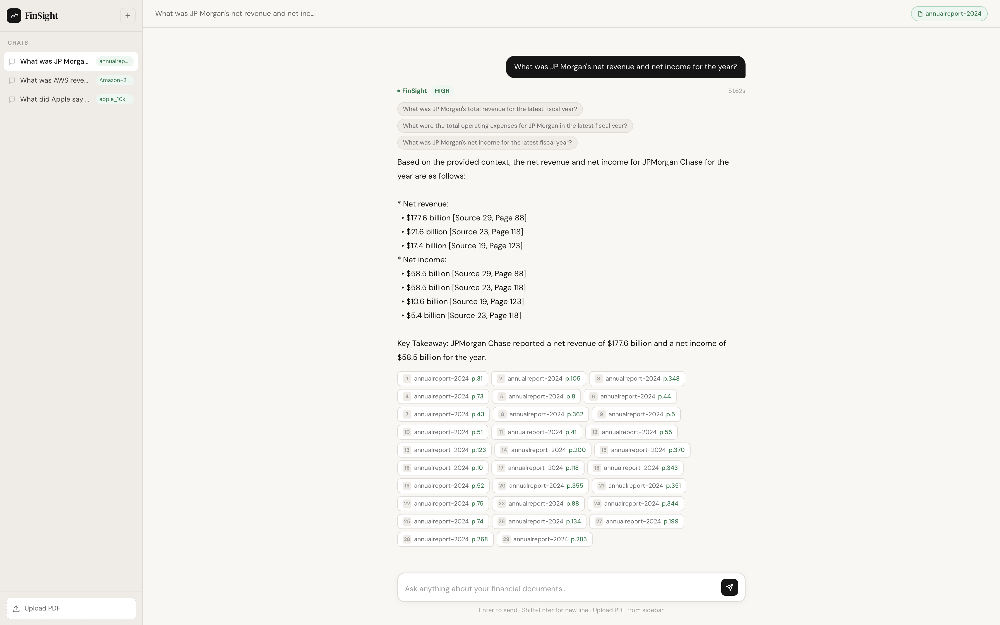

# FinSight — Multi-Agent Financial RAG System

> Ask anything about your financial documents. Get cited answers in seconds.

## Demo Video

https://github.com/Mish926/finsight/raw/main/screenshots/demo.mov

> Upload a financial PDF, ask questions, get cited answers — watch the full demo above.

FinSight is a production-grade **Retrieval-Augmented Generation (RAG)** system built with a multi-agent pipeline. Upload any financial PDF — 10-K, annual report, earnings filing — and query it with natural language. Four specialized AI agents work in sequence to decompose your question, retrieve relevant context, verify evidence quality, and synthesize a cited answer.



---

## Demo



> JP Morgan annual report queried for net revenue and net income — answered with exact figures and 29 page-level citations.

---

## How It Works

FinSight uses a **4-agent pipeline**, not a single LLM call. Each agent has a distinct responsibility:

```
User Question
      │
      ▼
┌─────────────┐
│  Planner    │  Decomposes complex questions into 2–4 sub-questions
└──────┬──────┘
       │
       ▼
┌─────────────┐
│  Retriever  │  Searches indexed document chunks for each sub-question
└──────┬──────┘
       │
       ▼
┌─────────────┐
│   Critic    │  Evaluates retrieved context — flags gaps, rates confidence
└──────┬──────┘
       │
       ▼
┌─────────────┐
│ Synthesizer │  Generates final answer with page-level citations
└─────────────┘
```

**Why multi-agent?**
A single LLM call hallucinates and lacks structure. The critic agent catches low-quality retrievals before synthesis. The planner ensures complex multi-part questions are fully answered. This mirrors how a financial analyst actually researches a document.

---

## Features

- **Chat history sidebar** — Claude.ai-style, each conversation saved with document tag
- **Multi-document support** — upload Apple, Amazon, JP Morgan separately, switch between chats
- **Page-level citations** — every answer references exact page numbers
- **Confidence scoring** — HIGH / MEDIUM / LOW based on retrieved evidence quality
- **Query decomposition** — complex questions split into sub-questions automatically
- **Local embeddings** — TF-IDF vectorization, no external embedding API needed
- **Clean minimal UI** — DM Sans + DM Serif Display, finance-focused design

---

## Tech Stack

| Layer | Technology |
|-------|-----------|
| LLM | Groq API (Llama 3.1 8B) — free tier |
| Embeddings | TF-IDF (scikit-learn) — fully local |
| Document parsing | PyMuPDF |
| Vector storage | NumPy + cosine similarity (pickle-persisted) |
| Backend | FastAPI + Uvicorn |
| Frontend | Vanilla HTML/CSS/JS — no framework |

---

## Recommended Documents

FinSight works best with **text-heavy financial PDFs** — not scanned images. Ideal document types:

| Type | Examples | Why it works |
|------|----------|-------------|
| **Annual Reports (10-K)** | Apple 10-K, Amazon 10-K | Dense financial data, risk factors, segment breakdowns |
| **Quarterly Reports (10-Q)** | Any SEC 10-Q filing | Revenue updates, guidance, management commentary |
| **Earnings Reports** | JP Morgan Annual Report | Income statements, balance sheets, segment performance |
| **ESG / Impact Reports** | Microsoft Impact Summary | Strategic goals, sustainability metrics |

**Where to find them:**
- SEC EDGAR: `https://www.sec.gov/cgi-bin/browse-edgar` — search by company ticker
- Company investor relations pages (search `[Company name] investor relations annual report`)
- JP Morgan: `https://www.jpmorganchase.com/ir/annual-report`
- Amazon: `https://ir.aboutamazon.com/annual-reports`
- Apple: `https://investor.apple.com/sec-filings/annual-reports`

> ⚠️ Avoid scanned PDFs (image-only). FinSight extracts text directly — the PDF must have selectable text.

---

## Demo Questions by Company

### Apple 10-K 2024
- What were Apple's net sales by product category?
- What are the main risk factors Apple disclosed?
- What did Apple say about its Services segment growth?
- What is Apple's cash position and capital return program?

### Amazon Annual Report 2024
- What was AWS revenue and how did it grow compared to last year?
- What is Amazon's operating income by segment?
- What risks did Amazon disclose around regulatory and antitrust concerns?
- What did Amazon say about its advertising business?

### JP Morgan Annual Report 2024
- What was JP Morgan's net revenue and net income for the year?
- What did JP Morgan say about credit loss provisions and loan quality?
- How did the investment banking segment perform?
- What are the key regulatory and capital risks JP Morgan disclosed?

---

## Requirements

- Python 3.9+
- macOS / Linux (Windows untested)
- A free [Groq API key](https://console.groq.com) — no credit card required

---

## Setup & Installation

### 1. Clone the repository

```bash
git clone https://github.com/Mish926/finsight.git
cd finsight
```

### 2. Install dependencies

```bash
pip install fastapi uvicorn pymupdf python-dotenv scikit-learn numpy groq python-multipart
```

### 3. Get a free Groq API key

1. Go to [console.groq.com](https://console.groq.com)
2. Sign up with Google — free, no credit card needed
3. Click **API Keys** → **Create API Key** → copy it

### 4. Set up environment variables

```bash
echo "GROQ_API_KEY=your_groq_api_key_here" > .env
```

### 5. Create required directories

```bash
mkdir -p data/pdfs data/index
```

### 6. Run the server

```bash
PYTHONPATH=. python api/app.py
```

### 7. Open in browser

```
http://localhost:5002
```

---

## Usage

1. **Upload a PDF** — click "Upload PDF" in the bottom-left sidebar
2. **Wait for indexing** — sidebar label updates when ready (5–15 seconds)
3. **Ask a question** — type in the input bar or click a suggested starter
4. **Read the answer** — citations show exact page numbers, hover for text preview
5. **New chat** — click **+** in the top left to start fresh with a new document

---

## Project Structure

```
finsight/
├── agents/
│   ├── planner.py        # QueryPlannerAgent — decomposes questions
│   ├── retriever.py      # RetrieverAgent — semantic search
│   ├── critic.py         # CriticAgent — evidence quality gate
│   └── synthesizer.py    # SynthesizerAgent — answer generation
├── core/
│   ├── document_processor.py   # PDF ingestion + chunking
│   ├── vector_store.py         # TF-IDF embeddings + search
│   └── pipeline.py             # Orchestrates all 4 agents
├── api/
│   ├── app.py                  # FastAPI server
│   └── templates/
│       └── index.html          # Full UI (single file, no framework)
├── data/
│   ├── pdfs/                   # Place your PDFs here
│   └── index/                  # Auto-generated vector index
├── screenshots/                # Demo screenshots
├── .env                        # Your API keys (not committed)
├── .gitignore
└── README.md
```

---

## Architecture Notes

**Why TF-IDF instead of neural embeddings?**
TF-IDF runs entirely locally with zero dependencies on PyTorch or FAISS. For financial documents with specific terminology — revenue figures, product names, segment labels — TF-IDF with bigrams performs well on exact-match retrieval without any GPU or heavy model downloads.

**Why Groq?**
Groq provides free-tier access to Llama 3.1 with fast inference and no credit card required. Can be swapped for OpenAI GPT-4o-mini by updating `core/pipeline.py` — all agent interfaces are model-agnostic.

**Chunking strategy**
Documents split into 500-character chunks with 100-character overlap, respecting sentence boundaries to preserve financial table context across chunk boundaries.

---

## Limitations

- Works best with text-based PDFs — scanned/image PDFs will not extract correctly
- TF-IDF retrieval may miss semantically similar content with different wording
- Groq free tier has rate limits — responses may take 30–60s under load
- Chat history stored in browser `localStorage` — persists across sessions but clears if browser data is wiped
- Server index resets on restart — re-upload your PDF after restarting the server

---

## Built With

- [FastAPI](https://fastapi.tiangolo.com/)
- [Groq](https://groq.com/)
- [PyMuPDF](https://pymupdf.readthedocs.io/)
- [scikit-learn](https://scikit-learn.org/)
- [DM Sans + DM Serif Display](https://fonts.google.com/)

---

## Author

**Mishika Ahuja** — [github.com/Mish926](https://github.com/Mish926)

---

*FinSight is a portfolio project demonstrating multi-agent RAG architecture for financial document analysis.*
