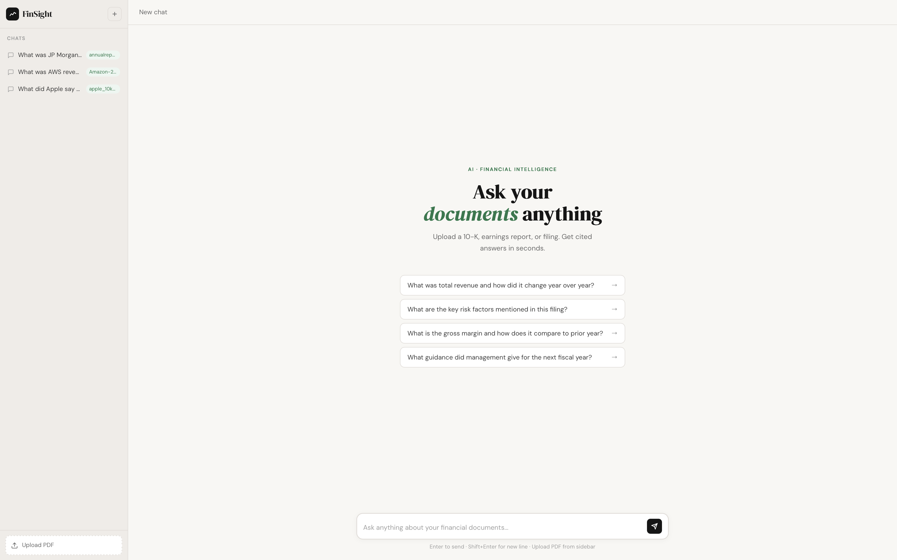
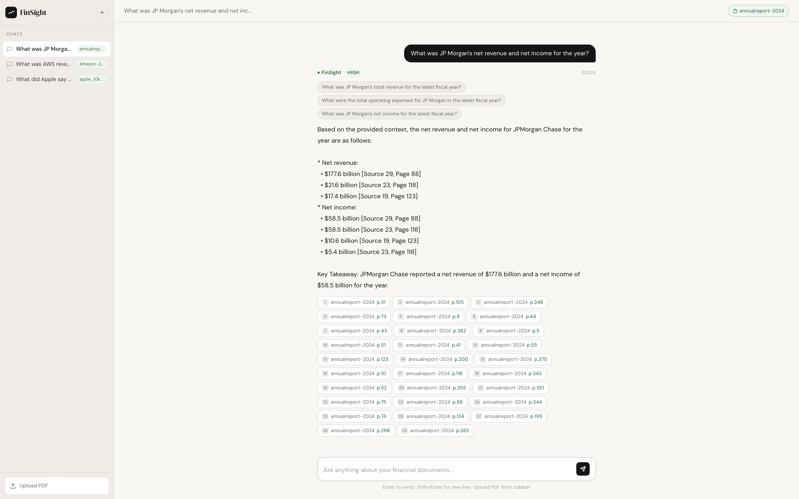

# FinSight — Multi-Agent Financial RAG System

> Ask anything about your financial documents. Get cited, verified answers in seconds.

FinSight is a **Retrieval-Augmented Generation (RAG)** system built with a multi-agent pipeline plus a deterministic post-generation verification layer. Upload any financial PDF — 10-K, annual report, earnings filing — and query it with natural language, across multiple documents at once. Four specialized AI agents decompose your question, retrieve relevant context, verify evidence quality, and synthesize a cited answer — which is then checked, and corrected if needed, against the actual source tables before you ever see it.



---

## Demo



> JPMorgan annual report queried for net revenue and net income — answered with exact figures and page-level citations.

▶️ **[Watch the full demo video](https://drive.google.com/file/d/1-Eui3cneaNpEyTpzbHNkdLhbScVHnDdh/view?usp=sharing)**

---

## How It Works

FinSight uses a **4-agent pipeline**, not a single LLM call. Each agent has a distinct responsibility:

```
User Question
      │
      ▼
┌─────────────┐
│  Planner    │  Decomposes complex questions into 2–4 sub-questions
└──────┬──────┘
       │
       ▼
┌─────────────┐
│  Retriever  │  Hybrid TF-IDF+LSA search, source-aware across documents,
│             │  with financial-term query expansion and quality re-ranking
└──────┬──────┘
       │
       ▼
┌─────────────┐
│   Critic    │  Evaluates retrieved context — flags gaps, rates confidence
└──────┬──────┘
       │
       ▼
┌─────────────┐
│ Synthesizer │  Generates the answer, then a deterministic verifier checks
│ + Verifier  │  every cited figure against its actual source table and
│             │  auto-corrects confirmed mismatches before you see it
└─────────────┘
```

**Why multi-agent, and why verification on top of it?**
A single LLM call hallucinates and lacks structure. The Critic agent catches low-quality retrievals before synthesis, and the Planner ensures complex multi-part questions get fully answered. But even with careful prompting, a small free-tier LLM occasionally reads the wrong year's column out of a multi-year table — a real, observed failure mode. Rather than relying on prompting alone to prevent that, FinSight parses the actual cited table after generation and checks the number against it directly. If they don't match, it's corrected automatically, not just flagged.

---

## Features

- **Multi-document support** — upload multiple companies' filings into the same index and ask comparison questions across them, with retrieval that adapts automatically: single-company questions get full retrieval depth, cross-company questions get a fair, balanced share of context from every company involved
- **Document management UI** — see everything currently indexed, remove one document without affecting the rest, or clear the whole index — no code or server access required
- **Deterministic answer verification** — every cited financial figure is checked against its actual source table (or, for prose-format tables, against nearby chunks reconstructed from the same page) and corrected automatically if it doesn't match the year the question asked about
- **Hybrid retrieval** — TF-IDF (lexical) + LSA/TruncatedSVD (semantic) search, so a question about "revenue" can still find a chunk that only says "net sales"
- **Financial-term query expansion** — 30+ GAAP/SEC terminology clusters (revenue/net sales, net income/earnings, EPS, banking-specific terms like net interest income and provision for credit losses) so retrieval isn't thrown off by different filers using different words for the same line item
- **Table-structure-aware extraction** — tables are parsed with `pdfplumber` (both bordered and borderless detection strategies) into clean markdown alongside the normal prose extraction, with a quality filter that rejects tables where column detection clearly failed rather than injecting a confidently-wrong-looking table
- **Segment-vs-firm-wide disambiguation** — chunks that look like a business-segment breakdown (e.g. named divisions repeated across years) are automatically de-prioritized for questions that ask about the company as a whole, not a specific segment
- **Ratio/percentage sanity-checking** — any comparative claim in an answer ("X times higher than Y") is checked against the actual cited figures and stripped if unsupported, rather than left standing
- **Page-level citations** — every answer references exact page numbers
- **Confidence scoring** — derived from what the Synthesizer actually produced (citations present, no hedging language), not from the Critic's pre-synthesis guess, which is known to be overly conservative
- **Rate-limit resilience** — automatic retry with backoff on Groq's rate limits, plus a context-size budget tuned to the actual token density of financial text

---

## Observability & Evaluation

**AgentLens (`core/agent_lens.py`)** wraps every LLM call and tags it with the agent that made it. Each `/query` response includes an `agent_stats` block with per-agent token usage, latency, and estimated cost.

**Hallucination eval (`eval/hallucination_eval.py`)** runs golden questions through the live pipeline and scores numeric grounding and (optionally) LLM-judge faithfulness:
```
python -m eval.hallucination_eval --questions eval/golden_questions.json --judge
```

**Debug tooling** — three scripts for diagnosing retrieval/answer issues directly against the live index, built while tracking down real failures during development:
- `debug_pipeline.py` — runs one question through all 4 agents and prints the full, untruncated context sent to the Critic/Synthesizer
- `debug_search.py` — inspects raw retrieval ranking for a query against a specific document
- `debug_rank_check.py` — brute-force scans the index for a known figure and reports exactly what rank it gets, to distinguish a retrieval-ranking problem from a retrieval-budget problem from an extraction gap

---

## Known Limitations

Built and stress-tested against Apple, Amazon, and JPMorgan Chase — both FY2024 and FY2025 filings. Several real failure modes were found, diagnosed, and fixed during development (see below); the ones still open are documented honestly here rather than papered over:

- **Small-model reliability is reduced, not eliminated.** Llama 3.1 8B / 3.3 70B (Groq free tier) can still occasionally misread a table or hedge inconsistently, even with the verification layer and prompt guardrails in place. The deterministic verifier catches and corrects the specific, highest-stakes failure mode (wrong-year-column citations) with certainty when it fires — but it can only check citations that reference a chunk it can locate structure in; it isn't a guarantee against every possible reasoning error.
- **Query expansion is a curated list, not a learned one.** The financial-term synonym clusters (`agents/retriever.py`) cover the most common GAAP/SEC line items and banking-specific terms. Niche or industry-specific terms not yet in the list would need either an expansion or a return to full embedding-based semantic search.
- **No GPU-based neural embeddings.** PyTorch dropped Intel macOS wheel support after 2.2.2, incompatible with `transformers`' `torch>=2.4` requirement — so the semantic layer here is TF-IDF + LSA (`TruncatedSVD`), not sentence-transformer embeddings. This is a deliberate, tested tradeoff (lighter weight, zero platform-specific install issues) rather than an oversight; on a Linux/Apple Silicon deployment, real embeddings would be a straightforward upgrade path.
- **Single shared index across all users.** There's no per-session isolation yet — everyone using a given deployment shares the same document index. Fine for a personal or demo deployment; a genuinely multi-tenant public deployment would need session-scoped indexes.

### Fixed during development (documented for the engineering story, not because they're still open)
A non-exhaustive list of real, diagnosed-and-resolved issues, each found through actual testing rather than assumption: chunk ID collisions silently dropping one document's content when multiple documents were indexed; a frontend bug that wiped the entire index before every upload; PDF table extraction failing silently on borderless tables (the vast majority of real financial tables); a "clean-looking but wrong" table-extraction failure mode on JPMorgan's especially dense segment-reporting tables; cross-document source misattribution; multi-year table column misreading; retrieval budget being split evenly across irrelevant companies for single-company questions; a retrieval-boost fix that turned out to itself be the cause of a regression (verified via direct measurement, not assumption) and was removed.

---

## Tech Stack

| Layer | Technology |
|-------|-----------|
| LLM | Groq API — Llama 3.1 8B (Planner/Critic), Llama 3.3 70B (Synthesizer, with automatic fallback) |
| Retrieval | Hybrid TF-IDF (scikit-learn) + LSA/TruncatedSVD — fully local, no GPU |
| Document parsing | PyMuPDF (prose) + pdfplumber (structured tables, dual bordered/borderless detection) |
| Answer verification | Deterministic table-parsing cross-check (`core/answer_verifier.py`) |
| Vector storage | NumPy + cosine similarity (pickle-persisted, survives restarts) |
| Backend | FastAPI + Uvicorn |
| Frontend | Vanilla HTML/CSS/JS — no framework |

---

## Requirements

- Python 3.9+
- macOS / Linux (Windows untested)
- A free [Groq API key](https://console.groq.com) — no credit card required

---

## Setup & Installation

### 1. Clone the repository

```bash
git clone https://github.com/Mish926/finsight.git
cd finsight
```

### 2. Set up a virtual environment (recommended)

```bash
python3 -m venv .venv
source .venv/bin/activate
```

### 3. Install dependencies

```bash
python -m pip install -r requirements.txt
```

> **Note for Intel Mac users:** if `pip` doesn't isolate correctly to your venv, check for a shell alias with `grep "alias pip" ~/.zshrc` and use `python -m pip` explicitly instead of bare `pip`.

### 4. Get a free Groq API key

1. Go to [console.groq.com](https://console.groq.com)
2. Sign up — free, no credit card needed
3. Click **API Keys** → **Create API Key** → copy it

### 5. Set up environment variables

```bash
echo "GROQ_API_KEY=your_groq_api_key_here" > .env
```

### 6. Run the server

```bash
PYTHONPATH=. python api/app.py
```

### 7. Open in browser

```
http://localhost:5002
```

---

## Usage

1. **Upload PDFs** — click "Upload PDF" in the sidebar; upload multiple companies' filings to enable cross-company comparison questions
2. **Manage documents** — the "Indexed Documents" panel shows everything currently searchable; hover to remove one, or use "Clear all" to reset
3. **Ask a question** — type in the input bar; complex questions ("compare X, Y, and Z") are automatically decomposed
4. **Read the answer** — citations show exact page numbers; a confidence badge reflects whether the answer was fully grounded; a verification note appears if a figure was auto-corrected
5. **Manage chats** — hover over a chat in the sidebar for a delete option; "+" starts a new chat

---

## Project Structure

```
finsight/
├── agents/
│   ├── planner.py           # QueryPlannerAgent — decomposes questions
│   ├── retriever.py         # RetrieverAgent — hybrid search, query expansion,
│   │                        #   adaptive per-source retrieval, segment/title
│   │                        #   detection and re-ranking
│   ├── critic.py            # CriticAgent — evidence quality gate
│   └── synthesizer.py       # SynthesizerAgent — answer generation + verification
├── core/
│   ├── document_processor.py  # PDF ingestion: prose + table-aware chunking
│   ├── vector_store.py        # Hybrid TF-IDF+LSA embeddings, per-document removal
│   ├── pipeline.py            # Orchestrates all 4 agents + rate-limit retry
│   ├── agent_lens.py          # Per-agent token/cost/latency tracking
│   └── answer_verifier.py     # Deterministic post-generation figure verification
├── eval/
│   ├── hallucination_eval.py  # Numeric grounding + LLM-judge faithfulness scoring
│   └── golden_questions.json  # Sample eval question set
├── api/
│   ├── app.py                  # FastAPI server (upload, query, document management)
│   └── templates/
│       └── index.html          # Full UI (single file, no framework)
├── data/
│   ├── pdfs/                   # Uploaded PDFs (gitignored)
│   └── index/                  # Persisted vector index (gitignored)
├── debug_pipeline.py            # Diagnostic: full context inspection
├── debug_search.py               # Diagnostic: raw retrieval ranking inspection
├── debug_rank_check.py           # Diagnostic: figure-to-rank verification
├── screenshots/                  # Demo screenshots
├── requirements.txt
├── .env                           # Your API key (not committed)
├── .gitignore
└── README.md
```

---

## Architecture Notes

**Why TF-IDF + LSA instead of neural embeddings?**
Runs entirely locally with zero GPU/PyTorch dependency — a deliberate choice after PyTorch dropped Intel macOS wheel support past 2.2.2. LSA (`TruncatedSVD` on the TF-IDF matrix) adds a lightweight semantic layer that catches synonym gaps (e.g. "net sales" vs. "revenue") without needing an embedding model at all.

**Why two different Groq models?**
Planner and Critic just need to decompose questions and judge evidence sufficiency — the fast, cheap 8B model handles that well. The Synthesizer does the actual hard reasoning (reading multi-year tables correctly, not confusing a segment total for a firm-wide one), so it runs on the larger 70B model, with automatic fallback to the 8B model if it's ever unavailable.

**Why a deterministic verifier on top of prompting?**
Prompt instructions reduce a small model's tendency to misread a table column, but can't guarantee it. The verifier parses the actual cited chunk (or, if the table got split across chunk boundaries, searches nearby chunks and the full corpus for the missing header) and checks the number's column position against the year in question directly — a hard, testable check rather than another instruction hoping the model complies.

**Chunking strategy**
Documents are split into 900-character chunks with 300-character overlap (increased from an initial 500/100 after finding that smaller chunks were splitting table headers away from their data rows), plus separately-extracted table chunks via `pdfplumber` for anything with a genuine grid structure.

---

## Demo Questions

### Single-company
- What was Apple's total revenue for fiscal year 2024?
- What is Amazon's operating income by segment?
- What did JPMorgan say about credit loss provisions and loan quality?

### Cross-company (tests multi-document retrieval + verification)
- Compare the total revenue for Apple, Amazon, and JPMorgan for fiscal year 2024.
- What was JPMorgan's net income for fiscal year 2024, and how does that compare to Apple's and Amazon's?
- What percentage of Amazon's total revenue came from AWS?

---

## Built With

- [FastAPI](https://fastapi.tiangolo.com/)
- [Groq](https://groq.com/)
- [PyMuPDF](https://pymupdf.readthedocs.io/) + [pdfplumber](https://github.com/jsvine/pdfplumber)
- [scikit-learn](https://scikit-learn.org/)
- [DM Sans + DM Serif Display](https://fonts.google.com/)

---

## Author

**Mishika Ahuja** — [github.com/Mish926](https://github.com/Mish926)

---

*FinSight is a portfolio project demonstrating multi-agent RAG architecture, retrieval engineering, and deterministic answer verification for financial document analysis.*
